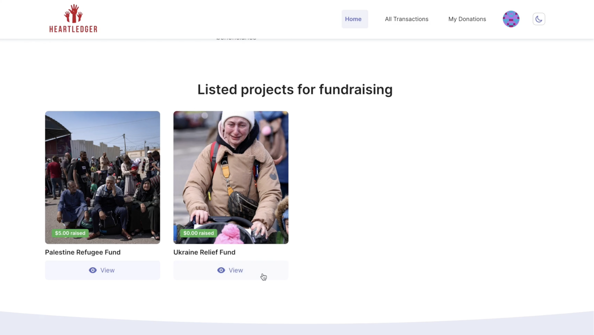
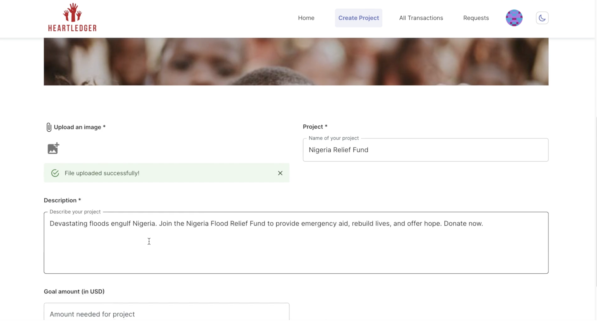
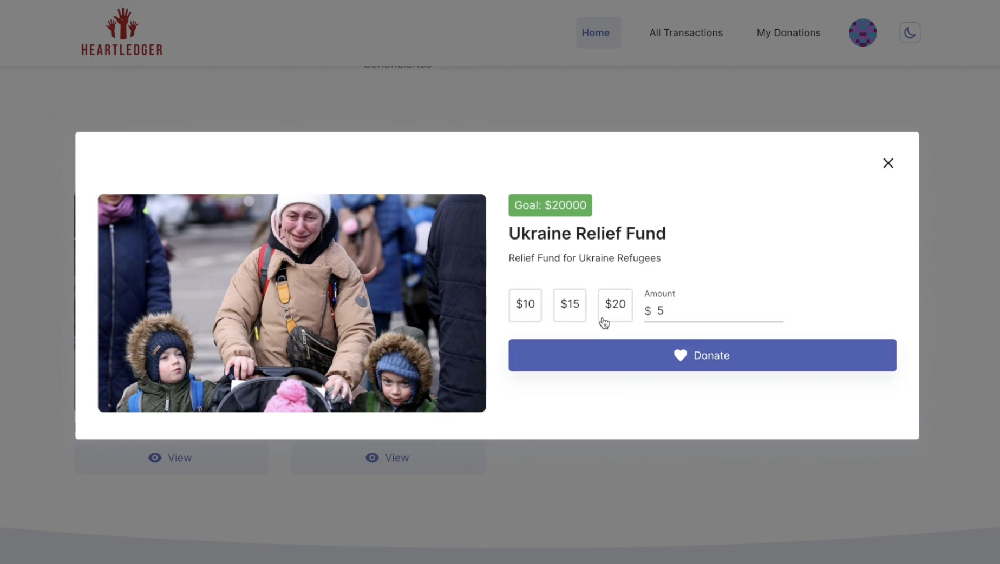
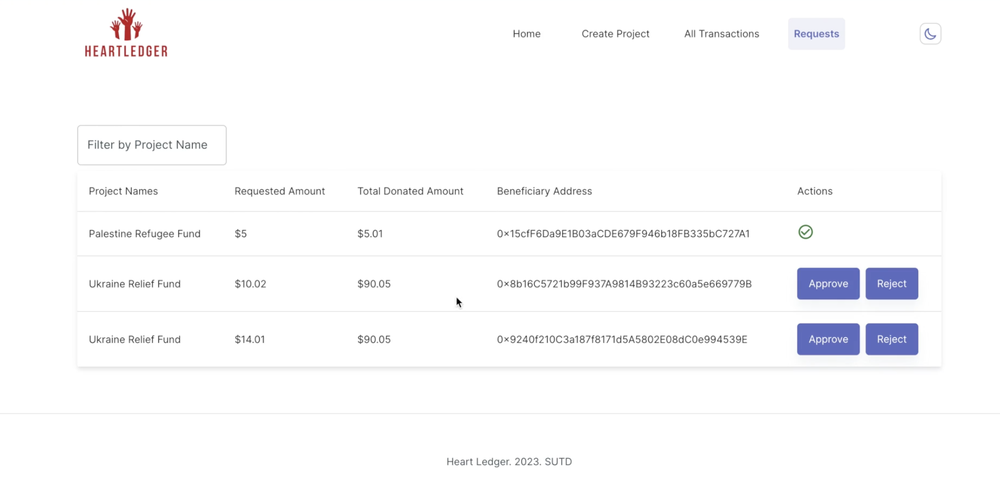
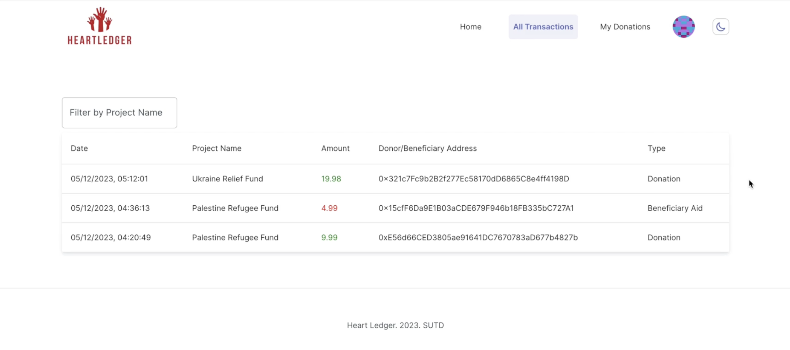

<!-- PROJECT LOGO -->
<br />
<div align="center">
   </img>

  <p align="center">
    Transparent & Decentralised Fundraising DApp
  </p>
  
</div>


## About The Project

<p align="left">
   Cryptocurrency-based fundraising campaign for a better distribution on the Polygon network. Accept donations in MATIC, provide donors with receipts, NGO to create and manage campaigns, and beneficiary to request and withdraw funds.
</p>

#### Network

Contract is deployed on Polygon mumbai network

```sh
0xE548f98dbF408cDD633F3cb7085C0550d8D3403b
```

https://mumbai.polygonscan.com/address/0xE548f98dbF408cDD633F3cb7085C0550d8D3403b


# How to Use the Platform

## 1. View All Projects & Transactions
- **Explore Projects**: Easily browse through all available projects listed on the platform.
- **View Transactionss**: View all transactions including donations and approved requests

## 2. Interact with a Project
- **Project Details**: Select any project to view its detailed information and progress.

## 3. For NGOs
- **Registration and Login**: NGOs can register and log in to access specialized features.
- **Create a Campaign**: After logging in, NGOs can initiate new fundraising campaigns, specifying their goals and requirements.

## 4. For Donors
- **Registration and Login**: Donors need to register and log in to make contributions.
- **Create Donation**: Once logged in, donors can contribute to any active campaign of their choice.
-  **View Requests**: View List of Donations belong to every Donor

## 5. For Beneficiaries
- **Registration and Login**: Beneficiaries should register and log in to request funds.
- **Request Funds**: After logging in, beneficiaries can submit requests for funding from available projects by any NGOs.

## 6. Campaign Management for NGOs
- **Approve or Reject Requests**: NGOs have the authority to review, approve, or reject funding requests from beneficiaries.
- **View Requests**: View List of Requests belong to every NGO

</img>
</img>
</img>
</img>
</img>
</img>


<p align="right">(<a href="#top">back to top</a>)</p>

### Built With

- [Next.js](https://nextjs.org/)
- [Material UI](https://mui.com/)
- [Truffle](https://trufflesuite.com/)
- [Solidity](https://docs.soliditylang.org/)
- [IPFS](https://ipfs.tech/)
- [cryptocompare](https://github.com/exodusmovement/cryptocompare)

<p align="right">(<a href="#top">back to top</a>)</p>

### Installation

Below are instructions to get started:

1. Clone the repo
   ```sh
   git clone [https://github.com/ac12644/Crypto-Charity.git](https://github.com/Dr-Lazarus/DApp/edit/integration/README.md)
   ```
2. Install packages
   ```sh
   npm install
   ```
3. Add environment variables, also you will require dedicated subdomain for IPFS from infura

```env
   PRIVATE_KEY=<your_private_key>
   POLYSCAN_API_KEY=<your_polyscan_api_key>
   MNEMONIC_KEY=<your_mnemonic_key>
   INFURA_API_KEY=<your_infura_api_key>
   INFURA_IPFS_ID=<your_infura_ipfs_id>
   INFURA_IPFS_SECRET=<your_infura_ipfs_secret>
   CONTRACT_ADDRESS=<deployed_contract_address>
```

4. Run application
   ```sh
   npm run dev
   ```

### Specification

#### Solidity Functions

1. NGO Create a new fundraiser

```solidity
function createFundraiser(
        string memory name,
        string memory image,
        string memory description,
        uint256 goalAmount
    ) public {
        Fundraiser fundraiser = new Fundraiser(
            name,
            image,
            description,
            goalAmount,
            msg.sender // Passing msg.sender as the custodian
        );
        _fundraisers.push(fundraiser);
        emit FundraiserCreated(fundraiser, msg.sender);
    }
```

2. Beneficiary Create Request

```solidity
function createRequest(
        address payable _beneficiary,
        uint256 _requestAmount
    ) public {
        require(
            totalDonations >= _requestAmount,
            "Insufficient funds for request"
        );

        _requests.push(
            FundsRequest({
                amount: _requestAmount,
                beneficiary: _beneficiary,
                ngoAddress: ngoAddress,
                status: RequestStatus.Pending
            })
        );
        emit RequestCreated(
            _beneficiary,
            _requestAmount,
            ngoAddress,
            fundName,
            block.timestamp
        );
    }
```

3. NGO Approve and Transfer Request

```solidity
  function approveRequest(uint256 requestId) public onlyOwner nonReentrant {
        require(requestId < _requests.length, "Invalid request ID");
        FundsRequest storage request = _requests[requestId];
        require(
            request.status == RequestStatus.Pending,
            "Request is not pending"
        );
        require(
            address(this).balance >= request.amount,
            "Insufficient contract balance"
        );
        totalDonations = totalDonations.sub(request.amount);
        request.status = RequestStatus.Approved;
        request.beneficiary.transfer(request.amount);

        emit RequestApproved(
            request.beneficiary,
            request.amount,
            request.ngoAddress,
            fundName,
            block.timestamp
        );
    }
```

4. NGO Reject Request

```solidity
    function rejectRequest(uint256 requestId) public onlyOwner {
        require(requestId < _requests.length, "Invalid request ID");
        FundsRequest storage request = _requests[requestId];
        require(
            request.status == RequestStatus.Pending,
            "Request is not pending"
        );

        request.status = RequestStatus.Rejected;

        emit RequestRejected(
            request.beneficiary,
            request.amount,
            request.ngoAddress,
            fundName,
            block.timestamp
        );
    }
```

5. Donor Create Donation

```solidity

    function donate() public payable {
        Donation memory donation = Donation({
            value: msg.value,
            date: block.timestamp,
            donor: msg.sender,
            fundName: fundName,
            ngoAddress: ngoAddress
        });
        _userDonations[msg.sender].push(donation);
        donationsCount++;
        totalDonations = totalDonations.add(msg.value);
        emit DonationReceived(
            msg.sender,
            msg.value,
            block.timestamp,
            fundName,
            ngoAddress
        );
    }

```

6. Return List of Projects/Campaigns

```solidity
 function fundraisers(
        uint256 limit,
        uint256 offset
    ) public view returns (Fundraiser[] memory coll) {
        require(offset <= fundraisersCount(), "offset out of bounds");

        uint256 size = fundraisersCount() - offset;
        size = size < limit ? size : limit;
        size = size < maxLimit ? size : maxLimit;
        coll = new Fundraiser[](size);

        for (uint256 i = 0; i < size; i++) {
            coll[i] = _fundraisers[offset + i];
        }

        return coll;
    }
```
7. Return list of donations

```solidity
function myDonations()
        public
        view
        returns (
            uint256[] memory values,
            uint256[] memory dates,
            string[] memory fundNames,
            address[] memory ngoAddresses
        )
    {
        uint256 count = myDonationsCount();
        values = new uint256[](count);
        dates = new uint256[](count);
        fundNames = new string[](count);
        ngoAddresses = new address[](count);

        for (uint256 i = 0; i < count; i++) {
            Donation storage donation = _userDonations[msg.sender][i];
            values[i] = donation.value;
            dates[i] = donation.date;
            fundNames[i] = donation.fundName;
            ngoAddresses[i] = donation.ngoAddress;
        }
    }
```


7. Return list of requests

```solidity
 function allRequests()
        external
        view
        returns (
            uint256[] memory requestID,
            uint256[] memory amounts,
            address[] memory beneficiaries,
            address[] memory ngoAddresses,
            RequestStatus[] memory statuses
        )
    {
        uint256 count = _requests.length;
        requestID = new uint256[](count); // Initialize the requestID array
        amounts = new uint256[](count);
        beneficiaries = new address[](count);
        ngoAddresses = new address[](count);
        statuses = new RequestStatus[](count);

        for (uint256 i = 0; i < count; i++) {
            FundsRequest storage request = _requests[i];
            requestID[i] = i; // Set the request ID
            amounts[i] = request.amount;
            beneficiaries[i] = request.beneficiary;
            ngoAddresses[i] = request.ngoAddress;
            statuses[i] = request.status;
        }
    }
```


